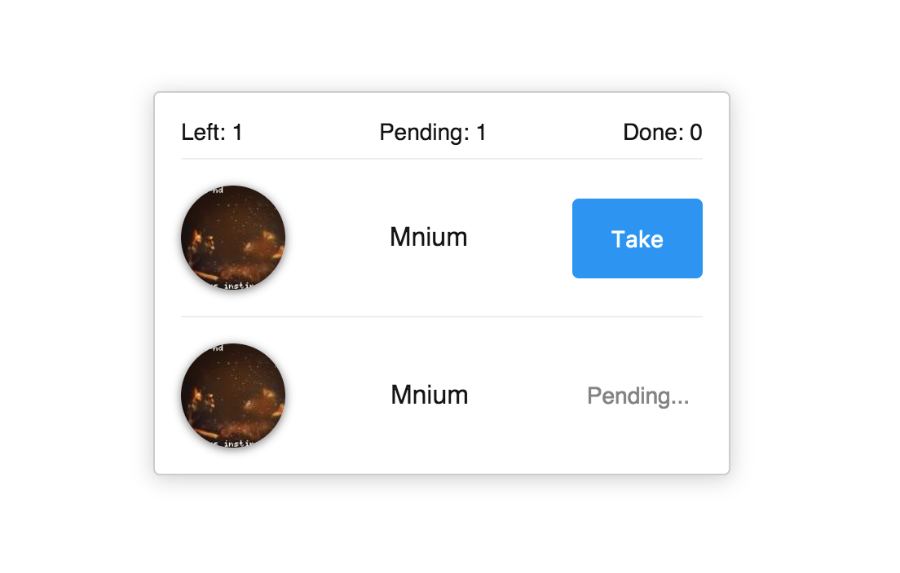

# Orders tracking app

## Requirements

- Develop an app with ClojureScript, Reagent and/or Re-frame
- Use markup and styles provided in `resources` directory
- Use image and text APIs
  - Image API http://loremflickr.com/100/100
  - Text API http://www.setgetgo.com/randomword/get.php
- Every `n` seconds add a new order to the list and set its status to `left`
- When user press `Take`, set `pending` status to a corresponding order
- After `n` seconds in `pending` status, set `done` status to a corresponding order and remove it from the list
- Track and display the amount of `left`, `pending` and `done` orders in the header of the app
